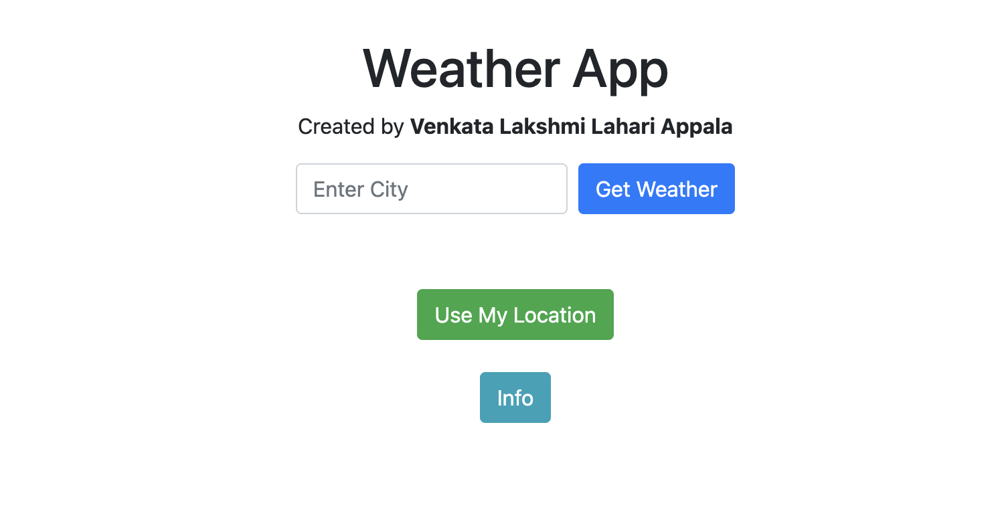
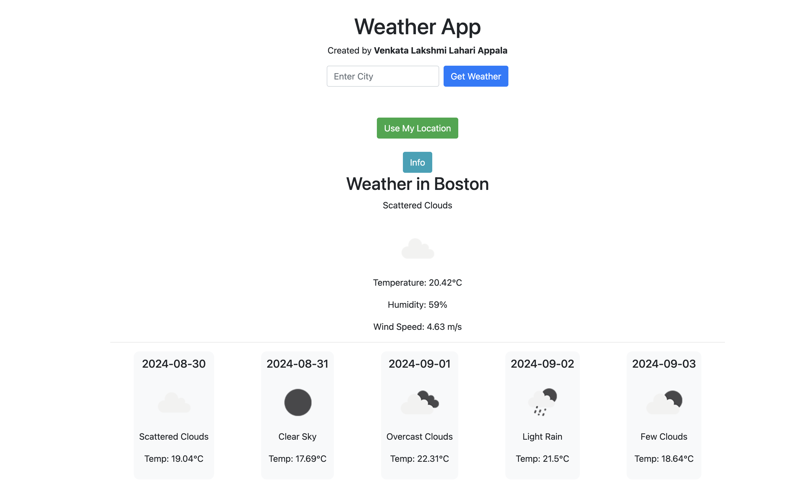

# Weather App

**Author**: Venkata Lakshmi Lahari Appala

## Overview
This Weather App allows users to:
- Enter a city and get the current weather.
- View a 5-day forecast for that city.
- Check the weather based on their current location using geolocation.
- View weather information with visually appealing icons and images.

Additionally, the app includes an "Info" button that provides a brief description of PM Accelerator.

## Features
- **Search by City**: Enter any city to get the current weather details.
- **5-Day Forecast**: Shows a 5-day weather forecast for the searched city.
- **Location-based Weather**: Fetches weather details based on the user's current location.
- **Weather Icons**: Weather conditions are displayed with dynamic icons for better visualization.
- **Info Button**: Provides information about PM Accelerator.

## Technologies Used
- **Python**
- **Flask**: Used as the web framework for serving the app.
- **OpenWeatherMap API**: Fetches real-time weather data.
- **Geocoder**: Retrieves the user's location for weather data based on geolocation.
- **HTML/CSS**: For front-end UI.

## Setup Instructions

### Prerequisites
Make sure you have Python 3 and `pip` installed on your system. You will also need an API key from [OpenWeatherMap](https://home.openweathermap.org/users/sign_up).

## Setup and Installation

1. **Clone the repository**:
    ```bash
    git clone https://github.com/lakshmilahari25/WeatherApp.git
    ```

2. **Navigate into the project directory**:
    ```bash
    cd WeatherApp
    ```

3. **Install the required dependencies**:
    ```bash
    pip install flask requests geocoder
    ```

4. **Set up your OpenWeatherMap API key**:
    - Sign up at [OpenWeatherMap](https://openweathermap.org/) and get your API key.
    - Replace `YOUR_API_KEY` in the `app.py` file with your OpenWeatherMap API key.

## Running the App

1. **Run the Flask application**:
    ```bash
    python app.py
    ```

2. **Access the app**:
    - Open your browser and go to `http://127.0.0.1:5000/`.


API Key Setup
Sign up for an API key at OpenWeatherMap. Add this key to the app.py file by replacing YOUR_API_KEY with your actual key.


api_key = "YOUR_API_KEY"

## How It Works

- **Search for Weather**: The user can search for a city's weather or use the geolocation feature to get the current weather.
- **Weather Details**: Weather details, such as temperature, humidity, and conditions, are fetched from the OpenWeatherMap API.
- **Weather Icons**: Icons are displayed to represent different weather conditions (e.g., sunny, cloudy, rainy).
- **5-Day Forecast**: The user can view a 5-day weather forecast.
- **Info Button**: The "Info" button provides details about PM Accelerator.


## Screenshots

### Interface


### City Weather Search


## Contact

For more information, contact [333lahari@gmail.com](mailto:333lahari@gmail.com).


## License

This project is licensed under the MIT License.
